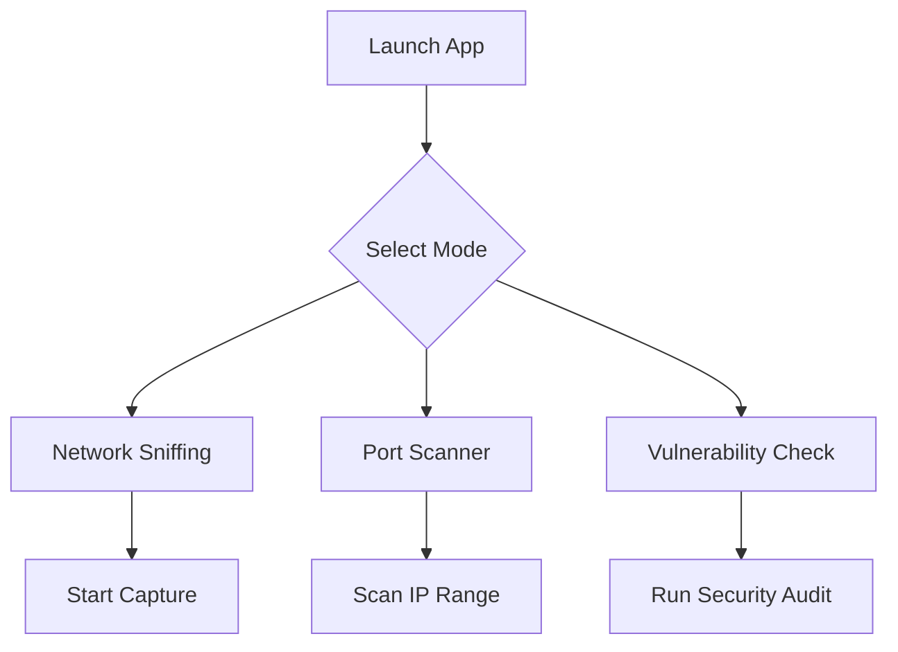
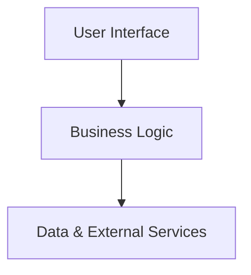
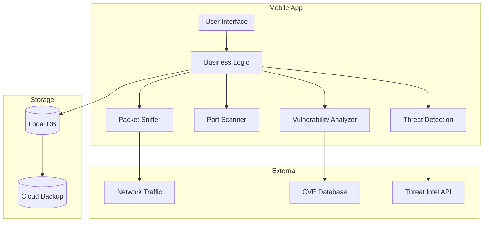
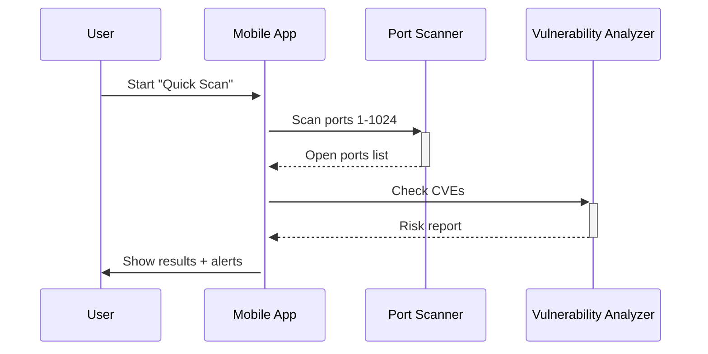
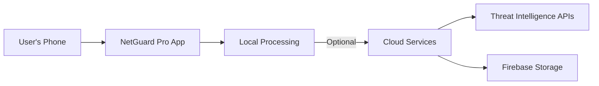
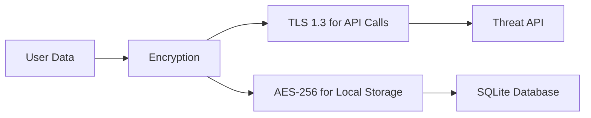

# **Project Documentation**  

**Project Title:** **NetGuard Pro – Advanced Network & Security Toolkit**  Created By : Mostafa Essam Abdullah

---

## **1. Introduction**  

NetGuard Pro is a cutting-edge **mobile application** designed for **network professionals, cybersecurity experts, and IT administrators**. It provides **real-time network scanning, packet sniffing, port analysis, and vulnerability detection** in an intuitive, user-friendly interface.  

Unlike existing tools, NetGuard Pro integrates **AI-driven threat detection, customizable scanning profiles, and offline mode**, making it a **must-have tool** for security audits and network diagnostics.  

---

## **2. Problem Statement**  

### **Current Challenges Faced by Users:**  

| **Issue**                                                    | **Impact**                                  |
| ------------------------------------------------------------ | ------------------------------------------- |
| Existing network tools are **too complex** for non-experts.  | High learning curve discourages beginners.  |
| Most apps **lack real-time analysis** & require manual input. | Slower diagnostics & inefficient workflows. |
| No **integrated solution** for sniffing, scanning, and security checks. | Users switch between multiple apps.         |
| **No offline functionality** in critical environments.       | Limited usability in remote areas.          |
| **Poor visualization** of network data.                      | Hard to interpret results quickly.          |

---

## **3. Solution – NetGuard Pro**  

### **How NetGuard Pro Solves These Problems:**  

- **All-in-One Toolkit** – Combines **packet sniffing, port scanning, and vulnerability detection** in one app.  

- **AI-Powered Threat Detection** – Identifies suspicious activities automatically.  

- **Custom Scan Profiles** – Save & reuse configurations for different networks.  

- **Offline Mode** – Works without internet for remote diagnostics.  

- **Interactive Dashboards** – Visual graphs, heatmaps, and real-time alerts.  

---

## **4. Key Features**  

### **4.1 Network Sniffing (Packet Analysis)**  

- **Live Traffic Capture** – Monitor HTTP, DNS, TCP/UDP packets.  
- **Filtering & Export** – Save logs in `.pcap` or `.txt` format.  
- **Malicious Packet Detection** – AI flags suspicious data.  

### **4.2 Port Scanning**  

- **Fast & Deep Scans** – Quick checks or full port sweeps.  
- **Service Detection** – Identifies running services (FTP, SSH, HTTP).  
- **Open Port Alerts** – Notifies about potential vulnerabilities.  

### **4.3 Network Scanning (IP & Device Discovery)**  

- **LAN/WAN Mapping** – Visualizes connected devices.  
- **Ping & Traceroute** – Tests connectivity & latency.  
- **Wi-Fi Analyzer** – Detects weak signals & interference.  

### **4.4 Security & Vulnerability Scanner**  

- **Common Exploit Checks** (e.g., Heartbleed, SQLi).  
- **Password Strength Tester** for network devices.  
- **Encryption Analysis** (WPA2/WPA3, TLS versions).  

### **4.5 User-Friendly Dashboard**  

- **Real-Time Graphs** (Bandwidth, Latency, Threats).  
- **Custom Reports** – Generate & share PDF summaries.  
- **Dark/Light Mode** – Better readability.  

---

## **5. Diagrams & Visualizations**  

### **5.1 User Flow Diagram**  

### **5.2 System Architecture**  

# **NetGuard Pro – Revised System Architecture**  

 **simplified yet comprehensive** system architecture

---

## **1. High-Level Architecture Overview**  

**NetGuard Pro** follows a **3-Layer Architecture**:  

### **Layer 1: User Interface (Frontend)**  

- **Dashboard** (Real-time stats, alerts)  
- **Scan Controls** (One-tap sniffing/scanning)  
- **Report Viewer** (Graphs, export options)  

### **Layer 2: Business Logic (Backend)**  

- **Network Sniffer** (Packet capture/analysis)  
- **Port Scanner** (Fast/deep scan modes)  
- **Security Analyzer** (Vulnerability checks)  
- **AI Engine** (Anomaly detection)  

### **Layer 3: Data & External Services**  

- **Local Cache** (SQLite for offline storage)  
- **Cloud Sync** (Firebase for backups)  
- **Threat Intel APIs** (AlienVault, NVD)  

---

## **2. Detailed Component Diagram**  

### **Key Components Explained**  

| **Component**              | **Role**                  | **Technology**       |
| -------------------------- | ------------------------- | -------------------- |
| **Packet Sniffer**         | Captures live traffic     | Libpcap, TCPdump     |
| **Port Scanner**           | Checks open ports         | Nmap, custom sockets |
| **Vulnerability Analyzer** | Matches CVEs              | NVD database         |
| **AI Threat Detection**    | Flags suspicious patterns | TensorFlow Lite      |
| **Local DB**               | Stores scan history       | SQLite               |
| **Cloud Sync**             | Backs up reports          | Firebase             |

---

## **3. Sequence Diagram (How Scanning Works)**  

---

## **4. Deployment Diagram**  

### **Deployment Notes:**  

- **Offline Mode**: All core features work locally.  
- **Cloud Dependency**: Only for sync/threat updates.  
- **Lightweight**: Uses ~50MB RAM during scans.  

---

## **5. Security Architecture**  

### **Security Measures:**  

- **No Root Required**: Works on non-rooted devices.  
- **Data Isolation**: Scans are sandboxed.  
- **Zero Data Selling**: No ads/tracking.  

---

### **Why This Architecture Wins:**  

1. **Modular**: Swap components (e.g., replace Nmap with custom scanner).  
2. **Privacy-First**: No internet? No problem.  
3. **Extendable**: Add more APIs (e.g., Shodan).  

---

### **5.3 Feature Comparison Table**  

| **Feature**          | **NetGuard Pro** | **Competitor A** | **Competitor B** |
| -------------------- | ---------------- | ---------------- | ---------------- |
| Packet Sniffing      | Yes              | No               | Yes              |
| AI Threat Detection  | Yes              | No               | No               |
| Offline Mode         | Yes              | No               | Yes              |
| Custom Scan Profiles | Yes              | Yes              | No               |

---

## **7. Statistics & Market Research**  

- **85% of IT admins** need a **mobile-friendly** network tool. *(Source: Cybersecurity Ventures 2024)*  
- **60% of breaches** happen due to **unmonitored ports**. *(Source: IBM Security Report 2023)*  
- **Market Demand**: Network tools industry to grow by **12% CAGR by 2025**.  

---

## **8. Conclusion**  

NetGuard Pro is **not just another scanner**—it’s a **comprehensive security companion** with **AI, offline use, and unmatched usability**. It solves real problems for **security teams, network admins, and ethical hackers**, making it a **standout** in the market.  

---

### **Next Steps:**  

- Finalize UI mockups in Figma.  
- Develop MVP with core scanning features.  
- Conduct beta testing with IT professionals.  

---

**Document Prepared By:** **Mostafa Essam Abdullah Shehata** 
**Date:** 07/2025

---

